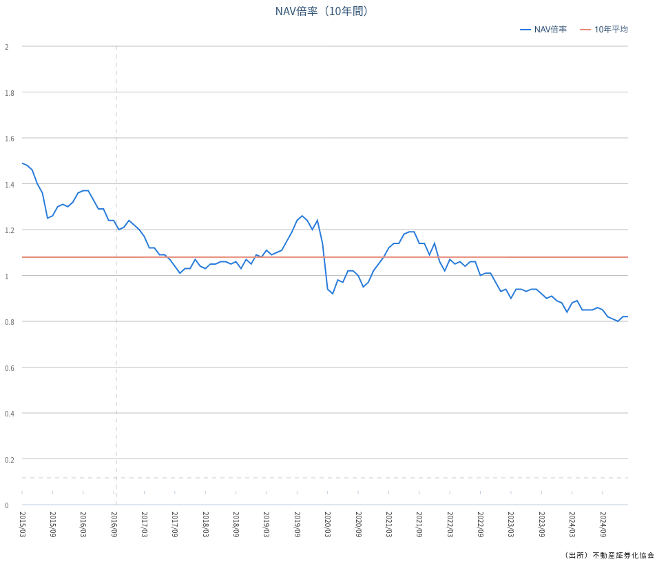

# 定量的評価

## 概要

本章では、J-REIT市場の定量的な評価を行います。NAV倍率、分配金利回り、LTV（負債比率）などの主要な指標を用いて、現在の市場価値と投資機会について分析を行います。

## バリュエーション指標

現在のJ-REIT市場は以下のバリュエーション水準にあります：

### NAV倍率

市場全体では概ね0.9〜1.1倍程度で、歴史的に見て中立的な水準です。NAV倍率とは、市場価格÷1口当たりNAV（純資産価値）の比率で、1倍未満であれば理論的には割安と考えられます。

NAV倍率の詳細な解釈：

1. NAV倍率が1倍の場合
: 市場価格が理論価値と同等であることを示します。

2. NAV倍率が1倍未満の場合
: 理論的には割安な状態を示唆します。
: 不動産価値に対して市場での評価が低いことを意味し、将来的な価格上昇の可能性があります。

3. NAV倍率が1倍超の場合
: 理論的には割高な状態を示唆します。
: 将来の成長期待や、保有不動産の質の高さが評価されている可能性があります。

NAV倍率の活用方法：

- 同一セクター内での相対比較
: 類似の不動産ポートフォリオを持つREIT間で比較することで、割安・割高判断の参考になります。

- 時系列での分析
: 個別REITの過去のNAV倍率推移と比較することで、現在の評価水準を判断できます。

注意点：
- NAVの算出には不動産評価額が用いられるため、評価の時点や手法による影響を受けます。
- マーケット環境や個別REITの特性によって、適正とされるNAV倍率は異なる場合があります。

*出典：[一般社団法人不動産証券化協会](https://j-reit.jp/market/08.html)*

### 分配金利回り

セクター平均で3.5〜4.0%程度であり、低金利環境下では依然として魅力的です。

### LTV（負債比率）

市場平均で約45%前後と、財務健全性は概ね維持されています。LTVとは総資産に対する負債の割合を示し、低いほど財務安全性が高いとされます。 